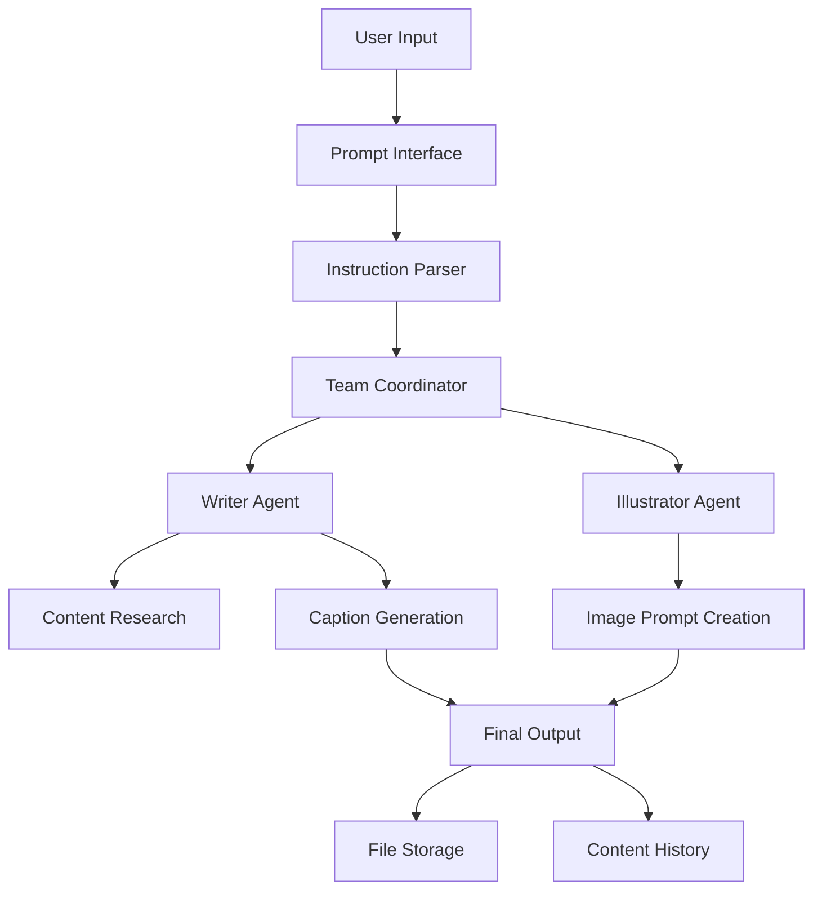

# 🍷 Multi-Agent Instagram Content Generator

<div align="center">


**An intelligent multi-agent system that creates professional Instagram content for wine & fine foods using AI collaboration**

[Features](#-features) • [Quick Start](#-quick-start) • [Usage](#-usage) • [Examples](#-examples) • [API Reference](#-api-reference)

---

</div>

## 🎯 Overview

This project implements a sophisticated **multi-agent AI system** that generates professional Instagram content focused on wine and fine foods. Built with the [Agno framework](https://docs.agno.com/), it leverages specialized AI agents working in coordination to create engaging social media posts with accompanying image generation prompts.

### 🧠 The Multi-Agent Architecture

Our system employs two specialized agents working together:

- **🖋️ Writer Agent**: Digital marketing expert specializing in wine & food content
- **🎨 Illustrator Agent**: Creates detailed image generation prompts
- **🤝 Team Coordinator**: Orchestrates the workflow and ensures quality output

*Based on the principle that "two specialists working together outperform a generalist."*

---

## ✨ Features

### 🚀 Core Capabilities

- **Natural Language Processing**: Understands complex, multi-line instructions
- **Intelligent Content Generation**: Creates SEO-optimized Instagram captions
- **Image Prompt Creation**: Generates detailed prompts for image generation tools
- **Multi-Agent Coordination**: Seamless collaboration between specialized agents

### 🎨 Content Features

- **Wine & Food Expertise**: Specialized knowledge in sommelier and gourmet topics
- **Flexible Styling**: Casual, professional, fun, elegant, or educational tones
- **Customizable Requirements**: No emojis, CTAs, hashtags, length preferences
- **Research Integration**: Uses DuckDuckGo for real-time topic research

### 💻 Technical Features

- **Advanced Prompt Interface**: Natural language instruction processing
- **Content History**: Tracks and manages generated content
- **File Management**: Organized output with automatic saving
- **Error Handling**: Robust retry mechanisms and error recovery
- **Interactive CLI**: User-friendly command-line interface

---

## 🚀 Quick Start

### Prerequisites

- Python 3.8+
- Google Gemini API key
- Basic knowledge of wine/food topics (recommended)

### Installation

1. **Clone the repository**

   ```bash
   git clone https://github.com/yourusername/multi-agent-instagram-generator.git
   cd multi-agent-instagram-generator
   ```

2. **Install dependencies**

   ```bash
   pip install agno duckduckgo-search google-genai
   ```

3. **Set up environment variables**

   ```bash
   # Create .env file
   echo "GEMINI_API_KEY=your_api_key_here" > .env
   ```

4. **Run the application**

   ```bash
   python instagram_content_generator.py
   ```

### 🎉 First Run

```bash
🍷 Instagram Content Generator - Advanced Prompt Interface
===============================================================
🤖 I can understand natural language instructions!
📝 Tell me what kind of Instagram content you want to create.

👉 Select an option (1-6): 1

🗣️  NATURAL LANGUAGE PROMPT MODE
Tell me exactly what you want - I'll understand your instructions:

Create a fun post about Italian Chianti wine
Make it educational but casual
Include food pairing suggestions
Add a call to action
END

✅ Content generated successfully!
📁 Check the './output' folder for saved files.
```

---

## 📖 Usage

### 🗣️ Natural Language Prompts

The system understands complex instructions in natural language:

```
Create an elegant post about French Bordeaux wines
Make it sophisticated and educational
Include pairing suggestions with aged cheese
Target wine enthusiasts
Add a professional call to action
No emojis please
```

### 🎯 Quick Topic Entry

For simple content generation:

```
Summer rosé and seafood pairings
```

### 📋 Supported Instructions

| Category | Examples |
|----------|----------|
| **Style** | `casual`, `professional`, `fun`, `elegant`, `educational` |
| **Length** | `short`, `brief`, `detailed`, `comprehensive` |
| **Requirements** | `no emojis`, `include CTA`, `add hashtags` |
| **Audience** | `beginners`, `experts`, `wine enthusiasts` |
| **Format** | `story format`, `list format`, `question style` |

---

## 💡 Examples

### Example 1: Beginner-Friendly Content

```
Input: "Write a casual post about wine tasting for beginners. 
       Make it approachable and include basic tips."

Output: Instagram post with wine tasting basics + image prompt
```

### Example 2: Professional Wine Content

```
Input: "Create a sophisticated post about vintage Burgundy wines. 
       Target wine collectors and include investment insights."

Output: Professional wine investment content + elegant image prompt
```

### Example 3: Food Pairing Focus

```
Input: "Generate a fun post about cheese and wine pairings. 
       Include specific recommendations and keep it educational."

Output: Engaging pairing guide + appetizing image prompt
```

---

## 🏗️ Architecture



### 🔧 Component Details

| Component | Responsibility | Technology |
|-----------|----------------|------------|
| **Prompt Interface** | Parse natural language instructions | Custom NLP logic |
| **Writer Agent** | Research topics and create captions | Gemini 2.0 + DuckDuckGo |
| **Illustrator Agent** | Generate image prompts | Gemini 2.0 |
| **Team Coordinator** | Manage workflow and agent communication | Agno Team |
| **File Manager** | Handle output and history | Python pathlib |

---

## 🔧 Configuration

### Environment Variables

```bash
# Required
GEMINI_API_KEY=your_gemini_api_key

# Optional
OUTPUT_DIR=./output              # Default output directory
DEBUG_MODE=false                 # Enable debug logging
MAX_RETRIES=3                   # Agent retry attempts
```

### Agent Configuration

```python
# Writer Agent Settings
WRITER_MODEL = "gemini-2.0-flash-lite"
WRITER_TOOLS = [DuckDuckGoTools()]
WRITER_BACKOFF = True

# Illustrator Agent Settings  
ILLUSTRATOR_MODEL = "gemini-2.0-flash"
ILLUSTRATOR_BACKOFF = True

# Team Settings
TEAM_MODE = "coordinate"         # coordinate, route, or collaborate
MONITORING = True                # Enable Agno monitoring
```

---

## 📊 API Reference

### InstagramContentGenerator

```python
class InstagramContentGenerator:
    def __init__(self, gemini_api_key: str, output_dir: str = "./output")
    def generate_content(self, topic: str, save_to_file: bool = True) -> dict
    def get_content_history(self) -> list
```

### PromptInterface

```python
class PromptInterface:
    def __init__(self, generator: InstagramContentGenerator)
    def process_prompt(self, prompt: str) -> dict
```

### Key Methods

#### `generate_content(topic, save_to_file=True)`

Generates Instagram content for a given topic.

**Parameters:**

- `topic` (str): Content topic related to wine/food
- `save_to_file` (bool): Whether to save output to files

**Returns:**

- `dict`: Generated content with metadata

#### `process_prompt(prompt)`

Processes natural language instructions.

**Parameters:**

- `prompt` (str): Natural language instruction

**Returns:**

- `dict`: Processed instruction with generated content

---

## 📁 Output Structure

```
output/
├── post.txt                    # Latest generated post
├── content_history.json        # All generation history
└── [timestamp]_[topic].txt     # Individual post files
```

### Sample Output

**post.txt:**

```
- Post
Discover the perfect harmony of bubbles and flavor! 
Sparkling water isn't just refreshing—it's the ideal 
palate cleanser for your gourmet adventures...

#SparklingWater #FoodPairing #GourmetLife #WineAndDine #Refreshing

- Prompt to generate an illustration  
A vibrant, well-lit grocery store scene showcasing premium 
sparkling water bottles alongside artisanal cheeses...
```

---

## 🧪 Testing

### Running Tests

```bash
# Install test dependencies
pip install pytest pytest-cov

# Run tests
pytest tests/ -v --cov=src/

# Run specific test category
pytest tests/test_agents.py -v
```

### Test Categories

- **Unit Tests**: Individual agent functionality
- **Integration Tests**: Multi-agent coordination
- **Prompt Tests**: Natural language processing
- **Output Tests**: File generation and formatting

---

## 🔍 Troubleshooting

### Common Issues

#### Authentication Error

```
❌ Error: GEMINI_API_KEY environment variable is required
```

**Solution:** Set your Gemini API key in environment variables or `.env` file

#### Module Import Error

```
❌ ImportError: No module named 'agno'
```

**Solution:** Install dependencies: `pip install agno duckduckgo-search google-genai`

#### Agent Timeout

```
❌ Agent request timeout
```

**Solution:** Check internet connection and API key validity

#### Empty Output

```
❌ No content generated
```

**Solution:** Ensure topic is related to wine/food domain

### Debug Mode

Enable debug logging:

```bash
export DEBUG_MODE=true
python instagram_content_generator.py
```

---

## 🚀 Advanced Usage

### Custom Agent Configuration

```python
# Create custom writer with specific focus
custom_writer = Agent(
    name="Sommelier Expert",
    role="Master sommelier specializing in French wines",
    description="Create expert-level wine content...",
    # ... additional configuration
)

# Initialize with custom agents
generator = InstagramContentGenerator(
    api_key="your_key",
    custom_agents={'writer': custom_writer}
)
```

### Batch Content Generation

```python
topics = [
    "Italian Barolo wine characteristics",
    "Cheese board assembly for beginners", 
    "Summer wine storage tips"
]

for topic in topics:
    result = generator.generate_content(topic)
    print(f"Generated content for: {topic}")
```

### Integration with Image Generation

```python
# Use the generated image prompt with DALL-E, Midjourney, etc.
result = generator.generate_content("Wine tasting techniques")
image_prompt = result['image_prompt']

# Send to your preferred image generation service
# generated_image = dalle.create(prompt=image_prompt)
```

---

## 🤝 Contributing

We welcome contributions! Here's how to get started:

### Development Setup

1. **Fork and clone**

   ```bash
   git clone https://github.com/yourusername/multi-agent-instagram-generator.git
   cd multi-agent-instagram-generator
   ```

2. **Create development environment**

   ```bash
   python -m venv venv
   source venv/bin/activate  # On Windows: venv\Scripts\activate
   pip install -r requirements-dev.txt
   ```

3. **Install pre-commit hooks**

   ```bash
   pre-commit install
   ```

### Contribution Guidelines

- 🐛 **Bug Reports**: Use the issue template
- ✨ **Feature Requests**: Describe use case and benefits  
- 🔧 **Pull Requests**: Follow the PR template
- 📝 **Documentation**: Update README and docstrings
- ✅ **Tests**: Add tests for new functionality

### Code Style

```bash
# Format code
black src/ tests/

# Check types
mypy src/

# Run linting
flake8 src/ tests/
```

---

## 📜 License

This project is licensed under the MIT License - see the [LICENSE](LICENSE) file for details.

---

## 🙏 Acknowledgments

- **[Agno Framework](https://docs.agno.com/)**: Powerful multi-agent AI framework
- **[Towards Data Science](https://towardsdatascience.com/)**: Original article inspiration
- **Google Gemini**: Advanced language model capabilities
- **DuckDuckGo**: Privacy-focused search integration

---

## 🌟 Star History

[](https://star-history.com/#yourusername/multi-agent-instagram-generator&Date)

---

## 📞 Support

- 📧 **Email**: <support@yourdomain.com>
- 💬 **Discord**: [Join our community](https://discord.gg/your-invite)
- 📖 **Documentation**: [Full docs](https://your-docs-site.com)
- 🐛 **Issues**: [Report bugs](https://github.com/yourusername/multi-agent-instagram-generator/issues)

---

<div align="center">

**Made with ❤️ by wine and food enthusiasts, for content creators**

[⭐ Star this project](https://github.com/yourusername/multi-agent-instagram-generator) • [🍴 Fork it](https://github.com/yourusername/multi-agent-instagram-generator/fork) • [📢 Share it](https://twitter.com/intent/tweet?text=Check%20out%20this%20amazing%20multi-agent%20Instagram%20content%20generator!)

</div>
